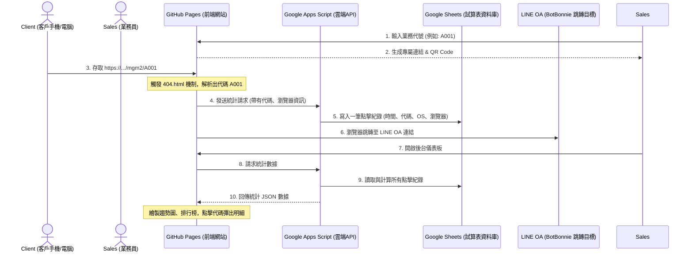

# MGM 業務推廣連結系統 - 需求與技術規格書

本文件旨在說明此 MGM (Member Get Member) 系統的系統架構、業務員專屬連結的生成原理，以及如何做到在無主機、免付費的 GitHub Pages 靜態空間中，收集客戶點擊時間、裝置資訊並進行實時統計的技術原理。

---

## 1. 系統運作架構 (System Architecture)

為了實現「零主機成本、高穩定度、即時統計」的需求，系統採用了 **Serverless (無伺服器)** 設計，將系統拆分為前端展示層與雲端資料儲存層：

---

## 2. 專屬邀請連結的生成原理

### 原理說明
業務員專屬連結的生成是在**瀏覽器端（Client-side）**即時完成的，不需經過任何後端伺服器運算。

### 步驟解析
1. **獲取基礎網址 (Base URL)**：
   JavaScript 透過 `window.location.origin`（取得協定與網域名稱，例如 `https://hub-google.github.io`）與 `window.location.pathname`（取得專案路徑，例如 `/mgm2/`），自動組合出當前網站的部署根目錄。
2. **拼接業務代碼 (Appended Code)**：
   當業務員在輸入框填入 `SALES88` 時，前端 JavaScript 會進行過濾（移除空格與特殊符號、自動轉為大寫），然後直接拼接到根目錄網址後方：
   $$\text{專屬網址} = \text{根目錄網址} + \text{業務代碼} \rightarrow \text{https://hub-google.github.io/mgm2/SALES88}$$
3. **二維碼即時繪製 (QR Code Generation)**：
   利用開源的 `qrcode.min.js` 函式庫，前端會直接將這串專屬網址字串，以 Canvas 或 SVG 的方式在瀏覽器畫面上渲染成二維碼圖片，並提供 PNG 格式的下載功能。

---

## 3. 客戶點擊追蹤與時間統計原理

在沒有實體伺服器（Node.js 或 PHP）的情況下，靜態空間（GitHub Pages）預設無法處理動態路徑與記錄資料庫。我們透過以下兩個核心技術攻克此難題：

### 技術一：GitHub Pages 的 404 路由攔截機制 (404 Routing Hook)
1. 當客戶瀏覽 `https://hub-google.github.io/mgm2/SALES88` 時，因為伺服器上並沒有一個叫做 `SALES88` 的真實檔案或資料夾，GitHub Pages 伺服器會判定為 404 錯誤。
2. 然而，GitHub Pages 允許開發者自訂 `404.html` 錯誤頁面。我們將 `404.html` 寫成一個**隱形跳轉網頁**。
3. 當此頁面被載入時，內嵌的 JavaScript 會讀取 `window.location.pathname`，透過斜線分割取出最後一個節點：
   $$\text{路徑零件} = \text{["mgm2", "SALES88"]} \rightarrow \text{提取出業務代碼} = \text{"SALES88"}$$
4. 藉此，我們成功在靜態網頁中獲取了客戶是透過哪位業務員介紹進來的。

### 技術二：Google Apps Script (GAS) 雲端 API 數據統計
在解析出 `SALES88` 後，客戶端瀏覽器會在背景偷偷做兩件事（以毫秒級的速度並行處理）：

1. **收集客戶裝置與環境資訊**：
   - 瀏覽器利用 `navigator.userAgent` 讀取客戶的作業系統（iOS, Android, Windows...）與瀏覽器版本（Chrome, Safari...）。
   - 利用 `document.referrer` 取得客戶是從哪個網頁點擊進來的（例如 FaceBook, Line 或直接輸入網址）。
2. **上報至 Google 試算表 (Google Sheet)**：
   - `404.html` 會發送一個非同步的 `fetch` 請求至您部署的 Google Apps Script 網頁應用程式（Web App）URL。
   - 請求攜帶了業務代碼、作業系統、瀏覽器與來源網址：
     `https://script.google.com/macros/s/[GAS-ID]/exec?action=log&code=SALES88&userAgent=...&referer=...`
   - Google 伺服器接收到此請求後，會自動在您的 Google 試算表中寫入一列資料，並**自動附上 Google 伺服器的時間戳記（ISO 8601格式，精確到毫秒）**。
3. **無縫重新導向**：
   - 在發送請求的同時，`404.html` 的 JavaScript 會執行 `window.location.href = "https://r.botbonnie.com/H52rK"`，將客戶在 0.5 秒內跳轉到最終 LINE OA 連結，完成加入好友。

---

## 4. 數據排行榜與明細查詢原理

當系統管理員打開 [GitHub Pages 儀表板](https://hub-google.github.io/mgm2/) 時，網頁會向同一個 GAS API 發送 `action=stats` 請求，GAS 會讀取 Google 試算表內的所有點擊紀錄並在 Google 雲端進行運算：

1. **基本指標計算**：
   - 讀取試算表總列數，得出 **總點擊次數**。
   - 統計有多少個不重複的 `Code`，得出 **累計推廣業務員數**。
   - 過濾點擊時間，計算今天凌晨至今的點擊數，得出 **今日新增點擊**。
2. **趨勢分析（Chart.js）**：
   - 腳本會過濾出最近 7 天的日期，並計算每天對應的點擊總和，回傳給前端。前端利用 Chart.js 將這組數據畫成精美的霓虹折線圖。
3. **即時排行榜與明細**：
   - 排行榜表格會列出各個業務代碼的累計點擊數。
   - 排行榜中每個 `Code` 綁定了點擊監聽器（Event Listener）。當點選如 `SALES88` 時，前端會向 GAS 發送 `action=detail&code=SALES88` 請求。
   - GAS 會回傳試算表中所有 `Code` 等於 `SALES88` 的點擊時間、系統與瀏覽器明細。
   - 前端接收到資料後，會動態更新並顯示 Modal 彈出視窗，將**每一筆點擊的精確時間**以表格形式呈現在畫面上。
