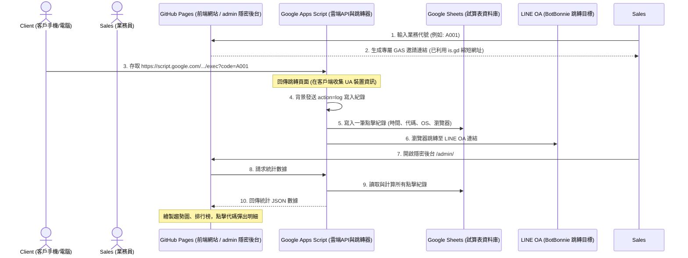

# MGM 業務推廣連結系統 - 需求與技術規格書

本文件旨在說明此 MGM (Member Get Member) 系統的系統架構、業務員專屬連結的生成原理，以及如何做到在無主機、免付費的 GitHub Pages 靜態空間中，收集客戶點擊時間、裝置資訊並進行實時統計的技術原理。

---

## 1. 系統運作架構 (System Architecture)

為了實現「零主機成本、高穩定度、即時統計」且「客戶完全防窺」的需求，系統採用了 **Serverless (無伺服器)** 設計，將系統拆分為前端展示層與雲端資料儲存層：

---

## 2. 專屬邀請連結的生成原理

### 原理說明
邀請網址在後台生成時，直接指向您部署的 **Google Apps Script (GAS) 服務 URL**（或透過 `is.gd` 縮短後的短網址），而非 GitHub Pages 網址。

### 步驟解析
1. **獲取 GAS API 網址**：
   前端 JavaScript (`js/app.js`) 讀取 `CONFIG.GAS_WEB_APP_URL` 取得專屬的 Apps Script Web App 連結。
2. **拼接業務代碼**：
   當業務員在輸入框填入 `SALES88` 時，前端將其清理並轉為大寫，拼接到 GAS 網址中作為 Query Parameter：
   $$\text{原始邀請連結} = \text{GAS\_WEB\_APP\_URL} + \text{"?code=SALES88"}$$
3. **調用短網址 API (is.gd)**：
   前端透過 `fetch` 非同步發送請求給 `is.gd` API，將上述長網址縮短為類似 `https://is.gd/xxxxxx` 的極簡網址。這樣一來，客戶看見的邀請連結是第三方短網址，掃描 QR Code 預覽也是短網址，徹底隱藏了您的後台架構。

---

## 3. 客戶點擊追蹤與時間統計原理

為了達到絕對的安全防護，客戶的瀏覽器在跳轉鏈中**完全不會接觸到 GitHub Pages 面板網址**：

### 步驟解析
1. **點擊短網址**：客戶點擊 `https://is.gd/xxxxxx`，被 `is.gd` 伺服器重新導向到 Google 的主機：
   `https://script.google.com/macros/s/[GAS-ID]/exec?code=SALES88`
2. **GAS 回傳隱形跳轉網頁**：
   Google Apps Script 接收到帶有 `code` 的請求，判斷這是客戶跳轉，於是動態回傳一段帶有 JavaScript 的 HTML 網頁。
3. **背景數據統計**：
   客戶瀏覽器在背景執行此 HTML 內的 JavaScript：
   - 提取客戶的 `navigator.userAgent`（作業系統與瀏覽器版本）與 `document.referrer`（推薦來源）。
   - 向同一個 GAS 發送背景 `fetch` 請求上報資料：
     `https://script.google.com/macros/s/[GAS-ID]/exec?action=log&code=SALES88&userAgent=...&referer=...`
   - Google 伺服器接收到資料後，寫入試算表，並**自動附加 Google 伺服器的精準時間戳記（ISO 8601，精確到毫秒）**。
4. **秒級跳轉至 LINE OA**：
   在上報發送的同時，網頁 JavaScript 執行 `window.top.location.href = "https://r.botbonnie.com/H52rK"`，在半秒內將客戶導向 LINE，完成加好友。
5. **安全防窺**：
   如果客戶手動把網址改為 `https://script.google.com/macros/s/[GAS-ID]/exec`（刪除業務代碼），GAS 會觸發防呆機制，直接將其跳轉至 LINE OA，客戶永遠不可能找到或發現您的管理後台 `hub-google.github.io/mgm2/admin/`。

---

## 4. 數據排行榜與明細查詢原理

管理人員打開隱密的管理後台 `https://hub-google.github.io/mgm2/admin/` 時，網頁向 GAS 請求 `action=stats`，進行數據呈現：

1. **基本指標計算**：
   - 讀取試算表總列數，得出 **總點擊次數**。
   - 統計有多少個不重複的 `Code`，得出 **累計推廣業務員數**。
   - 過濾點擊時間，計算今天凌晨至今的點擊數，得出 **今日新增點擊**。
2. **趨勢分析（Chart.js）**：
   - 腳本會過濾出最近 7 天的日期，並計算每天對應的點擊總和，回傳給前端。前端利用 Chart.js 將這組數據畫成精美的霓虹折線圖。
3. **即時排行榜與明細**：
   - 排行榜表格會列出各個業務代碼的累計點擊數。
   - 排行榜中每個 `Code` 綁定了點擊監聽器（Event Listener）。當點選如 `SALES88` 時，前端會向 GAS 發送 `action=detail&code=SALES88` 請求。
   - GAS 會回傳試算表中所有 `Code` 等於 `SALES88` 的點擊時間、系統與瀏覽器明細。
   - 前端接收到資料後，會動態更新並顯示 Modal 彈出視窗，將**每一筆點擊的精確時間**以表格形式呈現在畫面上。
